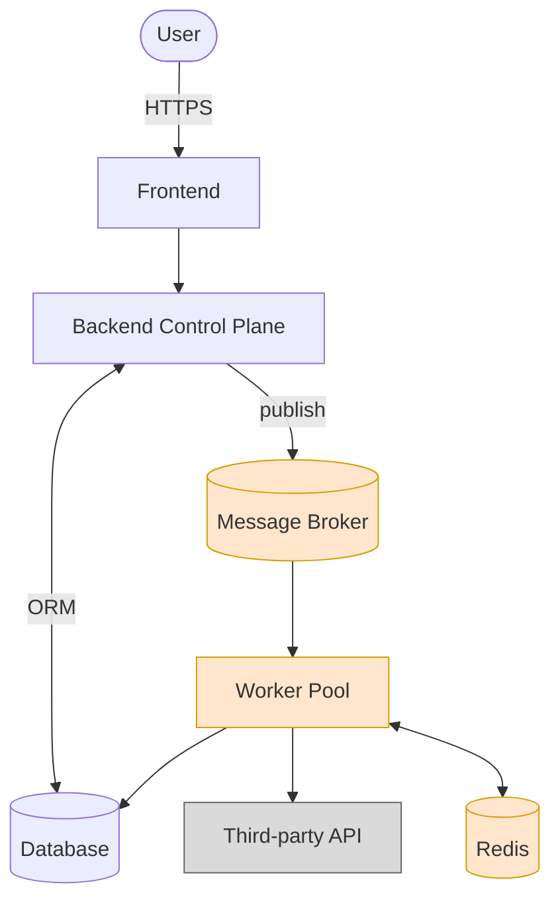
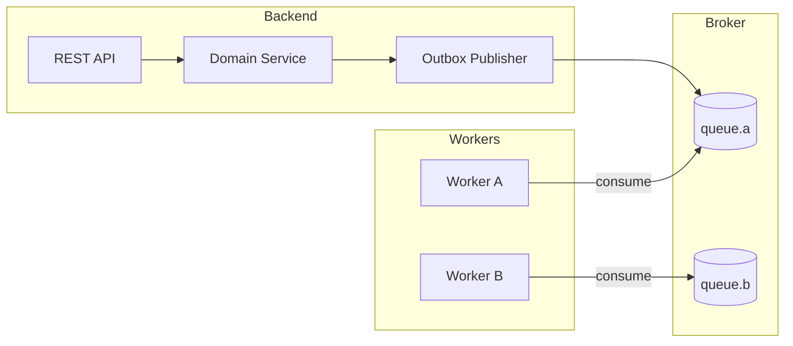
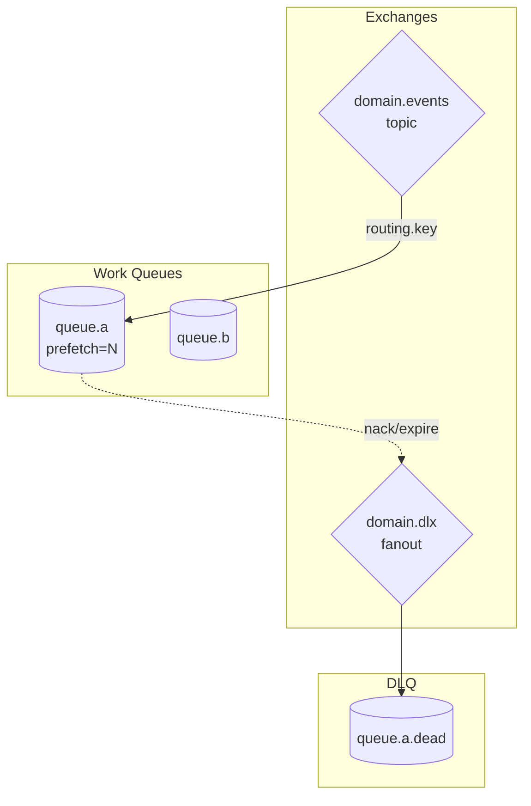
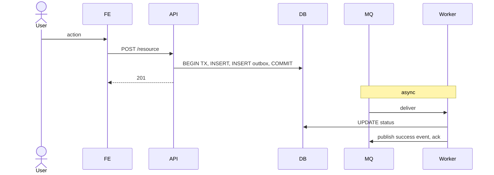
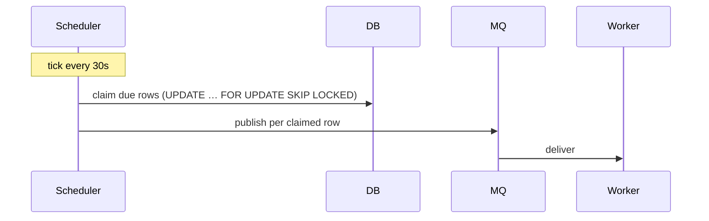
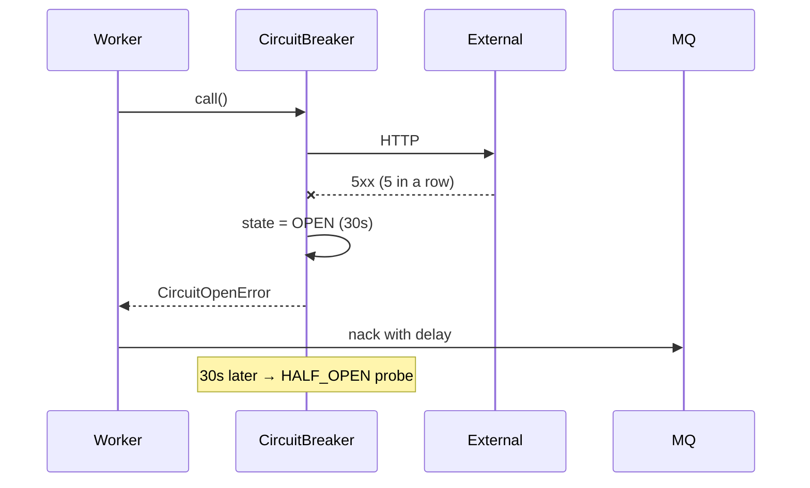
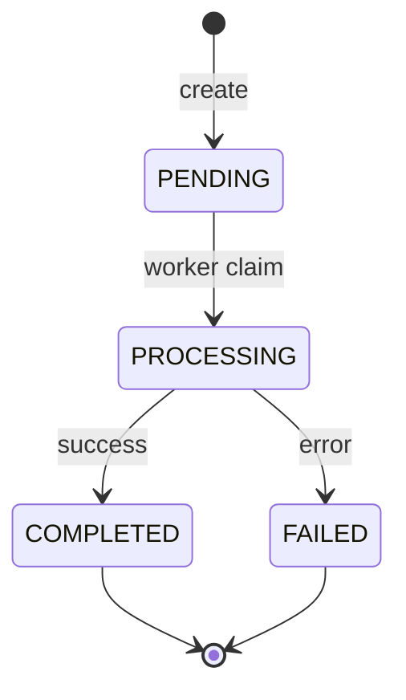
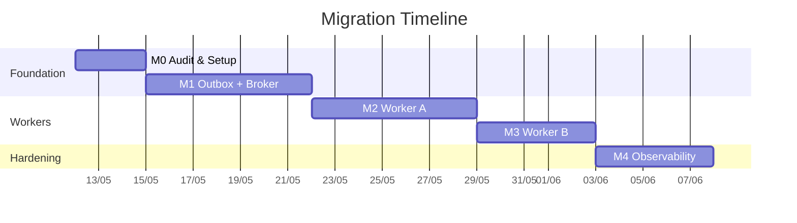

# Architecture: <Domain> Platform — <Subtitle>

> **Goal:** <one-sentence user-visible outcome — e.g. "100 livestreams → 100 elastic encoder instances, auto-stop when done">.
>
> **Scope:** <which subsystems, services, schemas this doc covers — and what's explicitly out of scope>
>
> **Core requirements:**
> - <requirement 1>
> - <requirement 2>
> - <requirement 3>
>
> **Related docs:**
> - `<../path/to/related-1.md>` — <one-line description>
> - `<../path/to/related-2.md>` — <one-line description>

---

## 1. Current state & pain points

### 1.1. Current state (POC / production)

| File / Component | Responsibility |
|---|---|
| `<path/to/file.ts>` | <what it does today> |
| `<path/to/other.ts>` | <what it does today> |

### 1.2. Pain points

| # | Problem | Impact |
|---|---|---|
| P1 | <concrete failure mode> | <user-visible or operational impact> |
| P2 | <concrete failure mode> | <impact> |
| P3 | <concrete failure mode> | <impact> |

---

## 2. High-level architecture

### 2.1. Context diagram (C4 Level 1)



**Legend:** orange = new components to build; grey = external systems; white = existing components being refactored.

### 2.2. Container diagram (C4 Level 2)



---

## 3. Component breakdown

### 3.1. <Component A>

**Responsibility:**
- <bullet>
- <bullet>

**Design notes:**
<one paragraph>

```typescript
// Canonical loop / config example
```

### 3.2. <Component B>

**Responsibility:**
- <bullet>

**Design notes:**
<one paragraph>

---

## 4. Domain events & queue topology

### 4.1. Event catalog

| Event | Producer | Consumer(s) | Purpose |
|---|---|---|---|
| `domain.aggregate.created` | API | WorkerA, Audit | <what triggers / what consumers do> |
| `domain.aggregate.requested` | Scheduler | WorkerA | <…> |
| `domain.aggregate.succeeded` | WorkerA | Notifier, Audit | <…> |
| `domain.aggregate.failed` | WorkerA | Compensator | <…> |

### 4.2. Queue topology



### 4.3. Routing key convention

```
domain.aggregate.created.{id}
domain.aggregate.requested.{tenant}.{id}
domain.aggregate.succeeded.{id}
domain.aggregate.failed.{id}
```

### 4.4. Idempotency & dedupe

<How consumers dedupe — Redis SETNX key, DB unique constraint, etc.>

---

## 5. Core flows

### 5.1. Flow: <happy path>



### 5.2. Flow: <scheduled / deferred>



### 5.3. Flow: <failure / circuit breaker>



---

## 6. State machines

### 6.1. <Aggregate> lifecycle



---

## 7. Schema changes

```sql
-- Outbox
CREATE TABLE <schema>.outbox_events (
  id            UUID PRIMARY KEY DEFAULT gen_random_uuid(),
  aggregate_id  UUID NOT NULL,
  event_type    VARCHAR(64) NOT NULL,
  routing_key   VARCHAR(128) NOT NULL,
  payload       JSONB NOT NULL,
  created_at    TIMESTAMPTZ NOT NULL DEFAULT now(),
  published_at  TIMESTAMPTZ NULL,
  attempt_count INT NOT NULL DEFAULT 0,
  last_error    TEXT
);
CREATE INDEX idx_<schema>_outbox_unpublished
  ON <schema>.outbox_events (created_at) WHERE published_at IS NULL;

-- Domain table additions
ALTER TABLE <schema>.<table>
  ADD COLUMN <new_col>      <type>,    -- <purpose>
  ADD COLUMN <another>      <type>;    -- <purpose>

-- Partial indexes for hot scans
CREATE INDEX idx_<table>_active
  ON <schema>.<table> (<col>)
  WHERE status IN ('PROCESSING','RUNNING');
```

---

## 8. End-to-end scenario

```
T0:    <event>
T0+1s: <next step>
T0+5s: <…>
T1h:   <…>
```

---

## 9. Tech stack

| Component | Tech | Why |
|---|---|---|
| Control plane | <NestJS / Go / …> | <reason> |
| Message broker | <RabbitMQ 3.13+ / Kafka / NATS> | <reason> |
| Database | <Postgres 15> | <reason> |
| Cache / rate limit | <Redis 7> | <reason> |
| Observability | Prometheus + Grafana | <reason> |

---

## 10. Migration plan



| Phase | Name | Output | Risk |
|---|---|---|---|
| M0 | Audit & Setup | Inventory + broker cluster | Low |
| M1 | Outbox + Broker | Events flowing for one event type | Low |
| M2 | Worker A | <pain point P_x> fixed | Med |
| M3 | Worker B | <pain point P_y> fixed | Low |
| M4 | Observability | Dashboard + alerts | Low |

**Rollback strategy:** each phase guarded by feature flag (`USE_<DOMAIN>_<FEATURE>=true`). Old code path retained for 2 phases.

---

## 11. Trade-offs

| Decision | Pros | Cons | Mitigation |
|---|---|---|---|
| <Broker choice> | <…> | <…> | <…> |
| <Worker model> | <…> | <…> | <…> |
| <Persistence choice> | <…> | <…> | <…> |

---

## 12. Acceptance criteria & SLOs

### 12.1. Functional

| # | Scenario | Expected |
|---|---|---|
| AC1 | <user action under normal load> | <observable result> |
| AC2 | <external dependency down> | <graceful degradation> |
| AC3 | <concurrent race> | <invariant held> |

### 12.2. SLOs

| Metric | Target |
|---|---|
| API latency P95 | < 300ms |
| Time-to-process P95 | < 5s |
| Outbox publish lag P99 | < 5s |
| Worker throughput | <N>/min/worker |

---

## 13. Risk register

| # | Risk | P | I | Mitigation |
|---|---|---|---|---|
| R1 | <risk> | Low/Med/High | Low/Med/High | <concrete mitigation> |
| R2 | <risk> | Med | High | <mitigation> |
| R3 | <risk> | Low | Med | <mitigation> |

---

## 14. Next steps

1. <concrete action — confirm strategy, start phase, etc.>
2. <concrete action>
3. <concrete action>

**Open questions / deeper dives:**
- <topic for follow-up doc>
- <topic for follow-up doc>
