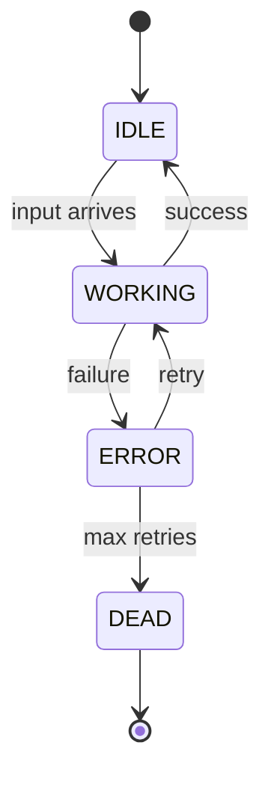

# <Component> Design

> **Scope:** Deep-dive on the `<component>` — how it's structured, how it makes decisions, how it fails and recovers.
>
> **Related:**
> - `<../parent-architecture.md>` — Where this component fits in the system
> - `<../sibling-deepdive.md>` — Related sibling component

---

## 1. Responsibility

`<Component>` is responsible for:

- <bullet>
- <bullet>
- <bullet>

It is **not** responsible for:

- <explicit non-goal>
- <explicit non-goal>

---

## 2. Why this component exists

<one to three paragraphs — what would break without it, what alternatives were considered, why this one wins>

---

## 3. Inputs & outputs

### 3.1. Inputs

| Source | Channel | Shape |
|---|---|---|
| <upstream service> | <queue / API / DB> | <payload schema or link> |

### 3.2. Outputs

| Sink | Channel | Shape |
|---|---|---|
| <downstream> | <event / API / DB write> | <payload schema or link> |

### 3.3. Side effects

- <DB writes>
- <external API calls>
- <metrics emitted>

---

## 4. Internal design

### 4.1. State machine



### 4.2. Core loop

```typescript
// Pseudo-code showing the canonical processing loop
async function tick() {
  // 1. measure
  // 2. decide
  // 3. act
  // 4. record
}
```

### 4.3. Configuration

| Setting | Default | Why |
|---|---|---|
| `<param>` | <value> | <reason> |
| `<param>` | <value> | <reason> |

---

## 5. Decision logic

<For autoscalers, schedulers, routers — explain the decision algorithm step by step with examples>

### 5.1. Algorithm

```
input: <signals>
output: <action>

1. compute X
2. if X > threshold → action A
3. else if X < threshold → action B
4. else → no-op
```

### 5.2. Worked examples

**Example 1: <scenario name>**

| Input | Value |
|---|---|
| <signal> | <value> |
| <signal> | <value> |

→ Decision: <action>, because <reason>.

**Example 2: <scenario name>**

<…>

---

## 6. Failure modes

| # | Failure | Detection | Response |
|---|---|---|---|
| F1 | <what breaks> | <how we notice> | <how we recover> |
| F2 | <what breaks> | <how we notice> | <how we recover> |

---

## 7. Observability

### 7.1. Metrics

| Metric | Type | Purpose |
|---|---|---|
| `<component>_decisions_total{action="…"}` | counter | Track decision distribution |
| `<component>_processing_duration_seconds` | histogram | P50/P95/P99 latency |
| `<component>_errors_total{reason="…"}` | counter | Error budget |

### 7.2. Logs

- Structured (JSON), correlation_id required
- Log every decision at INFO with inputs + chosen action
- Log every failure at ERROR with stack + retry decision

### 7.3. Alerts

| Alert | Threshold | Severity |
|---|---|---|
| <name> | <condition> | page / ticket |

---

## 8. Testing strategy

- **Unit:** decision logic with synthetic inputs (Section 5 examples become test cases)
- **Integration:** spin up real broker / DB / Redis, run a full tick, assert side-effects
- **Chaos:** kill mid-tick, kill dependency, verify recovery
- **Load:** synthetic 2× target rate for 1 hour

---

## 9. Open questions

- <question>
- <question>
