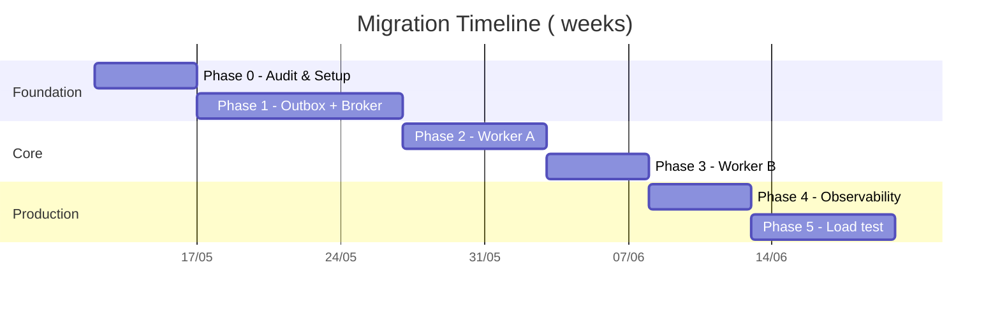

# Implementation Plan: <Domain> Migration

> **This doc:** Phased plan to move <domain> from <current state> to <target state>. Charts, task breakdown per phase, dependencies, rollback strategy, acceptance criteria.
>
> **Related:**
> - `<domain>-architecture.md` — Target architecture & tech choices
> - `<other-related>.md` — <description>

---

## Table of contents

1. [Overview & principles](#1-overview--principles)
2. [Architecture diagrams](#2-architecture-diagrams)
3. [State machines](#3-state-machines)
4. [Sequence flows](#4-sequence-flows)
5. [Queue topology](#5-queue-topology)
6. [Database schema](#6-database-schema)
7. [Implementation phases](#7-implementation-phases)
8. [Per-phase task breakdown](#8-per-phase-task-breakdown)
9. [Risk register](#9-risk-register)
10. [Acceptance criteria & metrics](#10-acceptance-criteria--metrics)

---

## 1. Overview & principles

### 1.1. Design principles

1. **Event-driven first** — inter-service communication via broker.
2. **Transactional outbox** — DB commit ⟺ event publish.
3. **Idempotent everywhere** — every handler tolerates duplicates.
4. **DB is source of truth, broker is transport** — broker never holds permanent state.
5. **Each phase is independently shippable** — feature-flagged, rollback-safe.

### 1.2. Timeline

---

## 2. Architecture diagrams

<copy relevant C4 context and container diagrams from the architecture doc>

---

## 3. State machines

<copy relevant state diagrams>

---

## 4. Sequence flows

<copy or reference the 3–5 most relevant flows>

---

## 5. Queue topology

<copy the queue topology diagram>

---

## 6. Database schema

<list all `ALTER TABLE` and `CREATE TABLE` statements grouped by phase>

---

## 7. Implementation phases

| Phase | Name | Output | Pain points fixed | Risk |
|---|---|---|---|---|
| P0 | Audit & Setup | Inventory + broker cluster | — | Low |
| P1 | Outbox + Broker | First event flow working end-to-end | P1, P9 | Low |
| P2 | Worker A | Async submission | P4, P5 | Med |
| P3 | Worker B | Async sync | P3 | Low |
| P4 | Observability | Dashboard + alerts | P10 | Low |
| P5 | Load test + Hardening | Verified SLOs | — | Low |

---

## 8. Per-phase task breakdown

### Phase 0 — Audit & Setup

**Goal:** <one-sentence>

**Tasks:**
- [ ] Inventory current cron jobs / single-instance services
- [ ] Provision broker cluster (3 nodes, durable storage)
- [ ] Add health-check endpoints
- [ ] Document existing state for rollback baseline

**Acceptance:**
- Broker reachable from BE and worker network
- Inventory document checked in

**Rollback:** N/A — no production change

---

### Phase 1 — Outbox + Broker

**Goal:** Get one event type flowing end-to-end, no behaviour change for users.

**Tasks:**
- [ ] Create `outbox_events` table
- [ ] Add outbox publisher with `pg_advisory_lock` leader election
- [ ] Refactor first domain write to insert outbox row in same transaction
- [ ] Wire one consumer to write to audit log
- [ ] Add Prometheus metrics: outbox lag, publish errors

**Acceptance:**
- Domain write → audit log entry within 5s P95
- Outbox publish lag P99 < 5s under normal load

**Rollback:** revert the publisher deploy; outbox rows stay in DB harmlessly

---

### Phase 2 — Worker A

<…>

### Phase 3 — Worker B

<…>

### Phase 4 — Observability

**Tasks:**
- [ ] Grafana dashboards: per-queue depth, consume rate, error rate
- [ ] Alerts: queue depth > X for > Y min, DLQ has messages, outbox lag P99 > 5s
- [ ] Runbook: how to drain DLQ, how to re-elect leader, how to scale up workers

**Acceptance:**
- All alerts have a documented runbook page
- Dashboard linked from on-call rotation

---

### Phase 5 — Load test + Hardening

**Tasks:**
- [ ] Synthetic load test at 2× target throughput
- [ ] Chaos: kill broker node mid-run, verify recovery
- [ ] Chaos: kill worker mid-job, verify re-delivery
- [ ] Fill out final SLO table from measured values

**Acceptance:** All AC rows in section 10 pass under load test

---

## 9. Risk register

| # | Risk | P | I | Mitigation |
|---|---|---|---|---|
| R1 | Broker becomes single point of failure | Low | High | 3-node cluster + quorum queues |
| R2 | Outbox publisher dies, events stuck | Low | High | Leader re-election; lag alert |
| R3 | Migration phase introduces regression | Med | Med | Feature flag per phase, keep old path for 2 phases |

---

## 10. Acceptance criteria & metrics

### 10.1. Functional

| # | Scenario | Expected |
|---|---|---|
| AC1 | <scenario> | <expected> |
| AC2 | <scenario> | <expected> |

### 10.2. SLOs

| Metric | Target |
|---|---|
| <metric> | <numeric target> |
| <metric> | <numeric target> |
