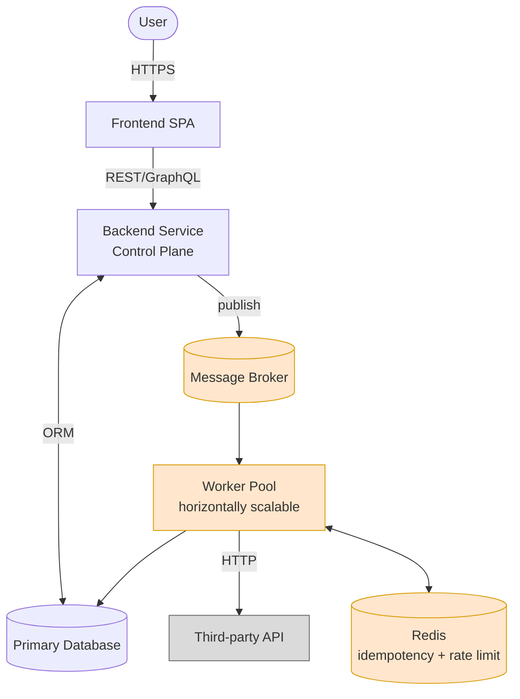
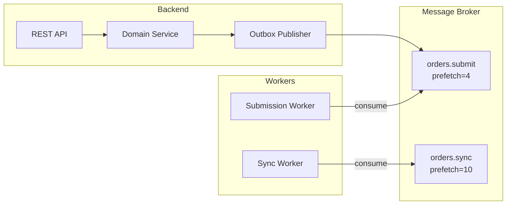
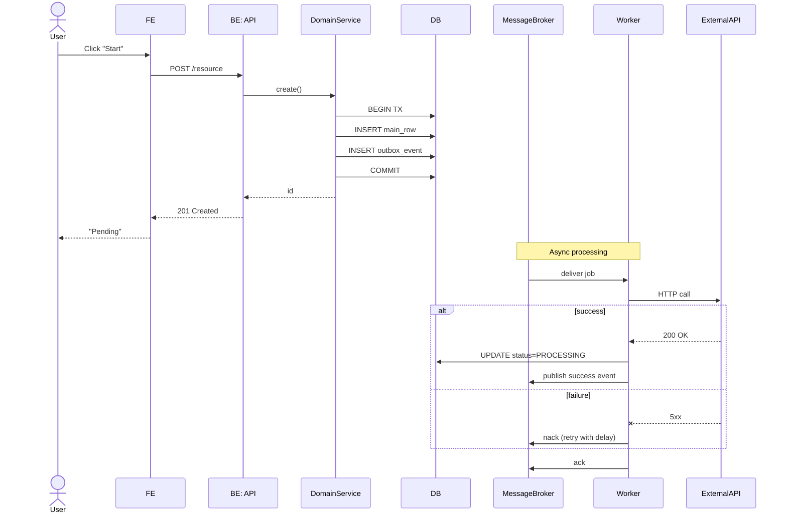
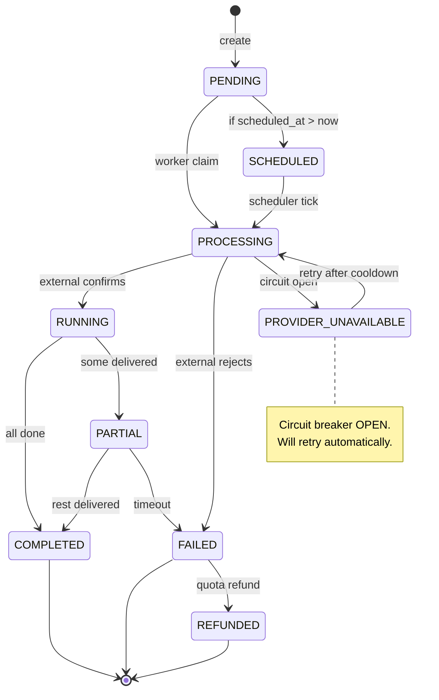
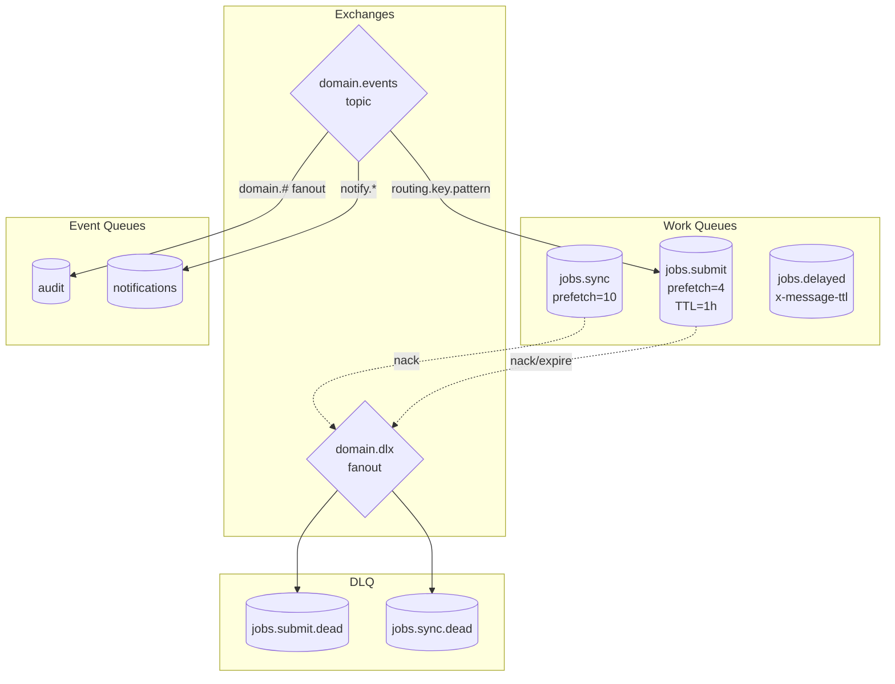
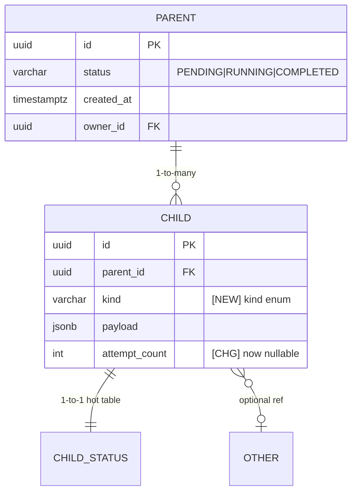
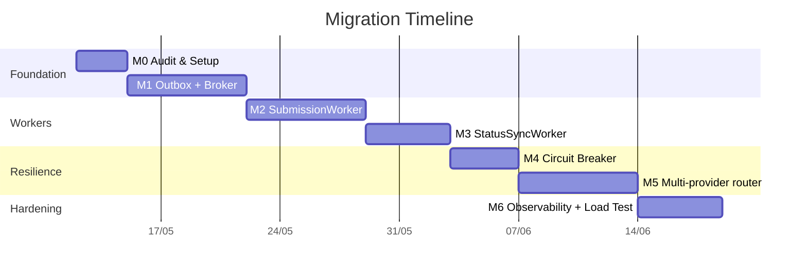
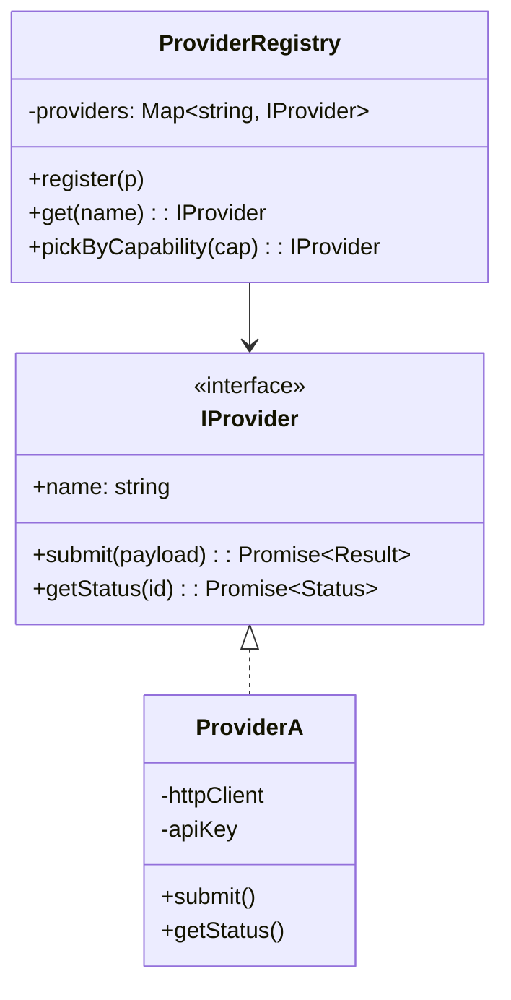

# Diagram Patterns

Copy-adapt these snippets. They are all proven in the reference corpus.

---

## 1. C4 Context (Mermaid)



**Legend convention:**
- Orange (`#ffe6cc`) = new component to build
- Grey (`#dadada`) = existing external system
- White = existing internal component being refactored

---

## 2. Container diagram (Mermaid `graph LR` with subgraphs)



Use subgraphs to mark deployment boundaries (a subgraph ≈ a process / pod / VM group).

---

## 3. ASCII boxed topology (when column alignment matters)

```
┌───────────────────────────────────────────────────────────────────┐
│                     CONTROL PLANE                                 │
│  ┌─────────────┐  ┌──────────────┐  ┌──────────────────────────┐  │
│  │ REST API    │  │ Domain Svc   │  │ Domain Event Publisher   │  │
│  │             │─▶│              │─▶│ (Outbox Pattern)         │  │
│  └─────────────┘  └──────┬───────┘  └──────────┬───────────────┘  │
│         │                │                     │                  │
│         ▼                ▼                     ▼                  │
│  ┌────────────────────────────────────────────────────────────┐   │
│  │  PostgreSQL (source of truth + outbox table)               │   │
│  └────────────────────────────────────────────────────────────┘   │
└───────────────────────────┬───────────────────────────────────────┘
                            │ publish
                            ▼
┌───────────────────────────────────────────────────────────────────┐
│                  MESSAGE BROKER (cluster)                         │
│   Exchange: <domain>.events  (topic)                              │
│       ├──▶ Queue: workers.jobs.pending                            │
│       │       └─ DLQ: workers.jobs.dead                           │
│       ├──▶ Queue: audit                                           │
│       └──▶ Queue: scaler.signals                                  │
└───────────┬─────────────────────────────────────┬─────────────────┘
            │ consume                             │ inspect depth
            ▼                                     ▼
┌──────────────────────────────┐  ┌─────────────────────────────────┐
│   WORKER POOL                │  │   AUTOSCALER CONTROLLER         │
└──────────────────────────────┘  └─────────────────────────────────┘
```

**Box-drawing kit:** `┌ ┐ └ ┘ ─ │ ├ ┤ ┬ ┴ ┼ ▶ ▼ ◀ ▲`

---

## 4. Sequence diagram (Mermaid)



**Rules:**
- `actor` for humans, `participant` for systems
- `participant X as Long Label` for renaming
- `-->>` for response, `->>` for sync call, `--x` for failure/timeout
- `Note over X,Y: text` for narration
- `alt`/`else`/`end`, `loop`/`end`, `par`/`and`/`end`, `opt`/`end`

---

## 5. State machine (Mermaid)



---

## 6. Queue topology (Mermaid `graph TB` with subgraphs)



---

## 7. ER diagram (Mermaid)



Annotate columns with `[NEW]`, `[CHG]`, `[DEL]` in the comment field to show migration deltas.

---

## 8. Gantt timeline (Mermaid)



**Rule:** the section names and `M<n>` IDs must match the phase table that follows.

---

## 9. Class diagram (Mermaid) — for adapter / registry patterns



---

## 10. Captioning rules

- One short line **above** the diagram naming what it shows.
- One short paragraph **below** explaining the non-obvious parts or the legend.
- For decision-rich diagrams, follow with a bulleted list of "what to notice".
